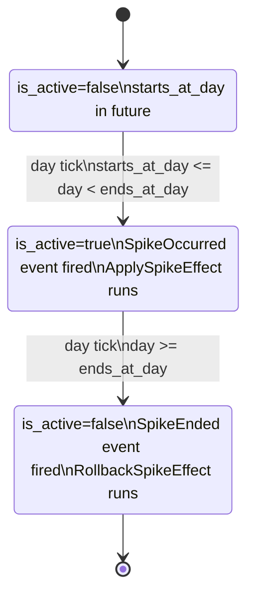

# Spike Events (Current Implementation + Proposed UX)

> Scope: Backend `SpikeEvent` lifecycle + the Inertia “War Room” page (`/game/spike-history`).
>
> Primary code references:
> - Scheduling/lifecycle: `app/Services/SimulationService.php`
> - Generation: `app/Services/SpikeEventFactory.php`, `app/Services/GuaranteedSpikeGenerator.php`, `database/seeders/SpikeSeeder.php`
> - Constraints: `app/Services/SpikeConstraintChecker.php`
> - Effects: `app/Services/Spikes/*.php`, `app/Listeners/ApplySpikeEffect.php`, `app/Listeners/RollbackSpikeEffect.php`
> - War Room UI: `resources/js/pages/game/spike-history.tsx`

## TL;DR Findings

- **Spike “types” are not driven by deterministic simulation conditions** today; they are chosen by **weighted randomness**, then filtered by **resource availability** (e.g., breakdown requires a location) plus **global constraints** (cap + cooldown).
- The system’s “clear/resolve” behavior is **time-based only**: a spike ends when the simulation day reaches `ends_at_day`.
- The War Room (`/game/spike-history`) is **read-only**: it displays history + status but provides **no action buttons** to resolve/clear spikes.
- Player-visible “clearing” today is effectively: **press “Advance Day” until the spike expires**.

## Data Model (How The Game Represents A Spike)

At a minimum, a spike event is a scheduled window on the simulation timeline:

- **Covers day**: `starts_at_day <= day < ends_at_day` (used in scheduling/constraint checks)
- **Active flag**: `is_active` (toggled by the simulation tick)

Key fields used by gameplay and UI (from `app/Models/SpikeEvent.php` and migrations):

| Field | Meaning |
| --- | --- |
| `type` | One of `demand`, `delay`, `price`, `breakdown`, `blizzard` |
| `magnitude` | Type-specific “strength” (see type table below) |
| `duration` | Days the spike is intended to last |
| `starts_at_day` / `ends_at_day` | Active window (half-open interval) |
| `is_active` | Whether the spike is currently active |
| `is_guaranteed` | Whether system-generated (guaranteed/seeded) |
| `location_id` | Optional context (required for `breakdown`) |
| `product_id` | Optional context (sometimes attached to `delay`, `demand`, `price`) |
| `affected_route_id` | Optional context (required for `blizzard`) |
| `meta` | JSON for “store original state” (used by `breakdown`) |

The model also supplies display fallbacks:
- `SpikeEvent::name` and `SpikeEvent::description` are computed if not stored (`app/Models/SpikeEvent.php`).

## Spike Types And “Clear Conditions” (What Makes A Spike A Type)

The **only canonical discriminator is** `spike_events.type`.

There is no additional server-side classification logic like “if demand > X then demand spike”; instead the generator chooses a type, then attaches optional context.

### Type Summary (Current)

| Type | Magnitude meaning | Required context | What changes in the world today | Where implemented |
| --- | --- | --- | --- | --- |
| `demand` | Multiplier `1.2–2.0` | none | No gameplay effect besides `is_active` | `app/Services/Spikes/DemandSpike.php` |
| `delay` | Integer days `1–3` | none (optional `product_id`) | Adds days to existing order `delivery_date` | `app/Services/Spikes/DelaySpike.php` |
| `price` | Multiplier `1.1–1.5` | none | No gameplay effect besides `is_active` | `app/Services/Spikes/PriceSpike.php` |
| `breakdown` | Reduction fraction `0.2–0.7` | `location_id` required | Reduces `locations.max_storage`, restores later | `app/Services/Spikes/BreakdownSpike.php` |
| `blizzard` | Currently `1.0` (effect is binary) | `affected_route_id` required (via `weather_vulnerability`) | Sets `routes.is_active = false`, restores later | `app/Services/Spikes/BlizzardSpike.php` |

### Are “clear conditions” encoded in the codebase?

**Yes**, clear conditions are properly encoded in backend:

- **Yes** for “when a spike is active” (window + `is_active` toggling via the simulation tick).
- **Yes** for global scheduling constraints (cap + cooldown).
- **Yes** for type-specific rollback logic via `SpikeTypeInterface` implementation:
  - `DemandSpike::rollback()` - sets `is_active=false`
  - `PriceSpike::rollback()` - sets `is_active=false`
  - `DelaySpike::rollback()` - sets `is_active=false` (does not restore delivery dates - see Known Gaps)
  - `BreakdownSpike::rollback()` - restores `locations.max_storage` from `meta.original_max_storage`
  - `BlizzardSpike::rollback()` - restores `routes.is_active=true` for affected route
- **No** for “why this type should occur” (no deterministic, simulation-driven type selection).
- **No** for “what a player must do to resolve it” (no player-driven resolution actions).

The automatic clearing is implemented in `SimulationService::processEventTick()`:
```php
SpikeEvent::where('user_id', $userId)
    ->where('is_active', true)
    ->where('ends_at_day', '<=', $day)
    ->get()
    ->each(function (SpikeEvent $spike) {
        $spike->update(['is_active' => false]);
        event(new SpikeEnded($spike));
    });
```

## How Spikes Are Generated (Current)

Spikes are created in three main ways:

1. **Seeded for a new game**: `database/seeders/SpikeSeeder.php` creates `3–5` spikes across Days `2–7`.
2. **Guaranteed spike coverage**: `SimulationService::ensureGuaranteedSpike()` ensures at least one spike covers “today” after Day 1 by calling `GuaranteedSpikeGenerator`.
3. **Optional future scheduling**: `SimulationService::scheduleOptionalSpike()` may schedule a spike starting tomorrow if constraints allow.

### Global Constraints (Current)

Constraints are enforced by `app/Services/SpikeConstraintChecker.php`:
- **Max concurrent spikes covering a day**: `MAX_ACTIVE_SPIKES = 2`
- **Type cooldown**: `TYPE_COOLDOWN_DAYS = 2` (same type cannot repeat too close)

### How Constraints Are Tracked

Constraint state is persisted in `game_states.spike_config` JSON field:
```php
// Example structure
{
  "spike_cooldowns": {
    "demand": 5,    // Last started on day 5
    "blizzard": 3,  // Last started on day 3
    "delay": 7
  },
  "active_spike_count": 2
}
```
- Updated by `SpikeConstraintChecker::recordSpikeStarted()` when a spike transitions to active
- Read by `getAllowedTypes()` to filter out types on cooldown
- Scoped per user via `game_states.user_id`

## How It Works In The Frontend (War Room)

The Inertia War Room route is:
- `GET /game/spike-history` → `GameController::spikeHistory()` → `resources/js/pages/game/spike-history.tsx`

What a player sees when there’s an active spike:
- A stats card showing **Active** count > 0.
- A red “Active Spikes” banner.
- The history table shows rows with a pulsing **Active** badge for active spikes.
- The global header shows a pulsing spike badge using shared `game.currentSpike` (`resources/js/components/game/game-header.tsx`).

What the player can do on the War Room page today:
- **Nothing to clear/resolve spikes directly.** There are no action buttons; it's informational only.
- Players cannot:
  - Mark a spike as "acknowledged" or "handled"
  - Pay to resolve a spike early
  - Execute mitigation actions from this page
  - Dismiss or hide spikes
- The only available actions are:
  - View the history table (sorted by date)
  - See statistics (total/active/resolved counts)
  - Navigate away to other pages (no deep links to affected resources)

## How A Spike Clears Today (Current)

A spike “clears” only by time advancement:

- The only gameplay action that progresses spike state is `POST /game/advance-day` (Advance Day button).
- On day advance, `SimulationService::processEventTick()`:
  - Deactivates spikes whose `ends_at_day <= current day`
  - Starts spikes whose window now covers the current day

So from a player perspective:
- To clear a spike, **advance the day until `day >= ends_at_day`**.

## New: Exact Spike Lifecycle (Per Type)

### Universal Lifecycle (All Types)



Implementation notes:
- The simulation tick is in `SimulationService::advanceTime()` → `processEventTick()`.
- Activation fires `SpikeOccurred`, which triggers:
  - `GenerateAlert` (player notification)
  - `ApplySpikeEffect` (apply type-specific side effects)
- Ending fires `SpikeEnded`, which triggers `RollbackSpikeEffect`.
- Additional side effect: `GenerateIsolationAlerts` auto-resolves related alerts when routes become active again:
  - Blizzard spikes that blocked routes → when `SpikeEnded` fires → route reactivated → isolation alerts for affected locations are marked `is_resolved = true`
  - This happens in the Analysis Tick via `GenerateIsolationAlerts::handle()` (lines 65-71 in `app/Actions/GenerateIsolationAlerts.php`)

### `demand` Lifecycle (Current)

- **Create**: `SpikeEventFactory` chooses `type=demand`, optional `location_id`/`product_id`.
- **Start condition**: `starts_at_day <= day < ends_at_day` (tick-based).
- **Apply**: `DemandSpike::apply()` sets `is_active=true` (no other effects).
- **While active**: ⚠️ **No systems currently use this spike** - inventory consumption, reorder calculations, and alerts do not check for active demand spikes or apply the `magnitude` multiplier. The spike exists only as a UI indicator.
- **Gameplay impact**: None (placeholder for future demand surge mechanics)
- **End condition**: `day >= ends_at_day`.
- **Rollback**: `DemandSpike::rollback()` sets `is_active=false` (no other effects).

### `price` Lifecycle (Current)

- **Create**: `SpikeEventFactory` chooses `type=price`, optional `location_id`/`product_id`.
- **Start condition**: tick-based.
- **Apply**: `PriceSpike::apply()` sets `is_active=true` (no other effects).
- **While active**: ⚠️ **No systems currently use this spike** - ordering costs are manual player input, and vendor pricing is not dynamically simulated. The `magnitude` field is stored but never applied.
- **Gameplay impact**: None (placeholder for future dynamic pricing)
- **End condition**: tick-based.
- **Rollback**: `PriceSpike::rollback()` sets `is_active=false`.

### `delay` Lifecycle (Current)

- **Create**: `SpikeEventFactory` chooses `type=delay`, optional `product_id`.
- **Start condition**: tick-based.
- **Apply**: `DelaySpike::apply()`:
  - Loads orders with status in `['pending','shipped']`
  - If `product_id` is set, restricts to orders that include that product
  - Adds `(int) magnitude` days to `orders.delivery_date`
  - Sets spike `is_active=true`
- **While active**: The "delay" is effectively already applied up-front by shifting dates.
- **End condition**: tick-based.
- **Rollback**: `DelaySpike::rollback()` currently only sets spike `is_active=false` (it does **not** restore the original `delivery_date` values).
  - ⚠️ **CRITICAL BUG**: Orders affected by delay spikes are **permanently delayed** even after the spike ends
  - Example: Order originally due Day 5 → Delay spike adds 2 days → Now due Day 7 → Spike ends → Still due Day 7 (not restored to Day 5)
  - This compounds over multiple delay spikes affecting the same orders
  - Fix requires: Store `meta.original_delivery_dates_by_order_id` on apply, restore on rollback

### `breakdown` Lifecycle (Current)

- **Create**: `SpikeEventFactory` only returns a breakdown spike if it can assign a `location_id`.
- **Start condition**: tick-based.
- **Apply**: `BreakdownSpike::apply()`:
  - Reads `locations.max_storage`, stores it in `spike.meta.original_max_storage`
  - Sets `locations.max_storage` to `max_storage * (1 - magnitude)`
  - Sets spike `is_active=true`
- **While active**: Reduced storage capacity is enforced by the `locations.max_storage` value.
- **End condition**: tick-based.
- **Rollback**: `BreakdownSpike::rollback()`:
  - Restores `locations.max_storage` from `spike.meta.original_max_storage`
  - Sets spike `is_active=false`

### `blizzard` Lifecycle (Current)

- **Create**: `SpikeEventFactory` only returns a blizzard spike if it can assign an `affected_route_id` from a `routes.weather_vulnerability = true` route.
- **Start condition**: tick-based.
- **Apply**: `BlizzardSpike::apply()` sets `routes.is_active=false` for `affected_route_id`.
- **While active**: Logistics pathfinding and route listings omit the disabled route.
- **End condition**: tick-based.
- **Rollback**: `BlizzardSpike::rollback()` sets `routes.is_active=true` for `affected_route_id`.

## New: Proposed “Clear/Resolve” UX Flow (Per Type)

### Design Goal

Make the War Room a place where players can:
1. Understand impact (what is affected + for how long),
2. Execute a “playbook” action path,
3. Mark the event as “handled” (even if it remains time-active), and
4. Optionally pay/act to **end** the event early when that makes sense.

### Important Terminology (Recommended)

To avoid conflicting meanings:
- Keep `is_active` = “the simulation considers this spike active right now”.
- Add a separate UX state, e.g.:
  - `acknowledged_at` (player has seen it)
  - `mitigated_at` (player took mitigating actions)
  - `resolved_at` + `resolved_by` (player forced an early end)

### War Room UI (Recommended Structure)

- Split War Room into two lists:
  - **Active Events** (cards with actions)
  - **History** (table, mostly read-only)
- Each Active Event card shows:
  - `name`, `type`, `description`
  - “Ends in X days” (`ends_at_day - game.day`)
  - Impacted entity (location/product/route)
  - Buttons:
    - **Open Playbook**
    - **Go To Affected Area** (deep link)
    - **Mark Mitigated**
    - **Resolve Early** (only when supported + with cost)

### `demand` — Proposed Flow

- **Player sees**: “Demand Surge” with affected location/product (if set) and remaining days.
- **Playbook actions (existing mechanics)**:
  1. Deep link to Ordering (`/game/ordering`) with filters prefilled (product/location).
  2. Deep link to Transfers (`/game/transfers`) to move stock from HQ to stores.
  3. Optional: suggest switching policy to Safety Stock (`PUT /game/policy`).
- **Mark mitigated when**:
  - Player places an order for the affected product OR creates a transfer into the affected location.
- **Resolve early (optional)**:
  - Allow paying cash/XP tradeoff to end early (concept: “run promo cooldown / demand shaping”).
  - Backend needs: endpoint to set `ends_at_day = current day` and immediately rollback (even if rollback is a no-op).

### `price` — Proposed Flow

- **Player sees**: “Price Spike” with affected product (if set) and remaining days.
- **Playbook actions (existing + future)**:
  1. If the game adopts vendor price lists: show “switch vendor” suggestion.
  2. If prices remain manual: show “review ordering costs” and route to Ordering page.
- **Mark mitigated when**:
  - Player updates ordering strategy (policy) or places an adjusted order (smaller quantity, alternate vendor).
- **Resolve early (optional)**:
  - “Negotiate contract” (pay a fee to end early) or “accept and adapt” (no early resolution).
  - Backend needs: pricing model support for this spike to have a real effect.

### `delay` — Proposed Flow

- **Player sees**: “Delivery Delay” with affected product (if any) and days of delay.
- **Playbook actions (existing mechanics)**:
  1. Route to Transfers: move inventory from other locations to cover the gap.
  2. Route to Ordering: place a new order from an alternative supplier source (if/when vendor locations are modeled).
- **Mark mitigated when**:
  - Coverage is established (e.g., inbound transfer created to the affected location).
- **Resolve early (requires backend work)**:
  - “Pay to expedite” could reduce delay or restore original delivery dates.
  - Backend needs:
    - Persist original delivery dates per impacted order (e.g., `meta.original_delivery_date_by_order_id`)
    - Implement a real rollback to restore dates when the spike ends or is resolved early.

### `breakdown` — Proposed Flow

- **Player sees**: “Equipment Breakdown” with affected location and capacity reduction %.
- **Playbook actions (existing mechanics)**:
  1. Route to Transfers: move stock out of the affected location to avoid over-capacity risk.
  2. Route to Ordering: avoid ordering into the constrained location; order into HQ instead.
- **Mark mitigated when**:
  - Player reduces inventory pressure (transfer out, stop inbound deliveries, etc.).
- **Resolve early (strong candidate)**:
  - “Dispatch Repair Crew” (pay cash) to restore capacity immediately.
  - Backend needs:
    - Endpoint to end spike early and call rollback (`BreakdownSpike::rollback()`), which already restores capacity via `meta.original_max_storage`.

### `blizzard` — Proposed Flow

- **Player sees**: “Blizzard Warning” with the affected route highlighted and “route disabled.”
- **Playbook actions (existing mechanics)**:
  1. Route to Logistics view (`/game/dashboard` logistics section) to see alternative paths.
  2. Route to Transfers/Ordering to re-plan shipments around the closure.
- **Mark mitigated when**:
  - Player successfully re-routes supply (creates transfers/orders that do not rely on the blocked route).
- **Resolve early (strong candidate)**:
  - “Clear Roads” (pay cash) to re-enable the route immediately.
  - Backend needs:
    - Endpoint to end spike early and call rollback (`BlizzardSpike::rollback()`), restoring `routes.is_active=true`.

## Frontend Components Gap

The codebase contains **two separate spike monitoring systems** that are not integrated:

### Backend Spike Events (Connected to War Room)

- **Real backend spikes** stored in `SpikeEvent` model and managed by `SimulationService`
- **War Room page** (`resources/js/pages/game/spike-history.tsx`) displays these backend spikes via Inertia
- **Read-only** - only shows history and status, no action buttons

### Frontend Mock Components (Disconnected)

These components use simulated data from `resources/js/services/spikeService.ts`:

- **SpikeMonitor** (`resources/js/components/SpikeMonitor.tsx`) - Real-time monitoring widget shown on Dashboard
  - Polls for "spikes" every 5 seconds using `detectSpikes()` function
  - Generates mock spike signals with emergency options (Courier, Vendor Expedite, Ignore)
  - Provides complete resolution flow: EmergencyActionModal → PostMortemModal
  - **Disconnected from backend `SpikeEvent` model** - uses only frontend mock data
  
- **SpikeHistory** (`resources/js/components/SpikeHistory.tsx`) - Interactive history component
  - Generates mock spike history with `generateSpikeHistory()` function
  - Shows detailed analysis with charts, root cause classification, resolution timeline
  - **Disconnected from backend `SpikeEvent` model** - uses only frontend mock data

- **spikeService.ts** - Frontend-only spike detection and generation
  - `detectSpikes()` - Simulates spike detection based on inventory/consumption ratios
  - `getEmergencyOptions()` - Generates mock emergency response options
  - `generateSpikeHistory()` - Creates mock historical spike events with charts
  - **No backend integration** - all data is client-side simulated

### Implications

- Players see **different spike data** depending on which page they're on:
  - Dashboard shows `SpikeMonitor` with mock spikes
  - War Room shows backend `SpikeEvent` records
- The mock resolution flow (EmergencyActionModal, PostMortemModal) has **no persistence**
- Frontend "spikes" are cleared by dismissing the component, not by any game mechanic
- No connection between mock spike detection and real game simulation

## Known Gaps / Risks Worth Tracking

These are not UX proposals; they are current behavior that affects correctness/clarity:

- **No War Room resolution actions exist today** (`resources/js/pages/game/spike-history.tsx` is informational only).
- **`delay` rollback is incomplete** (orders stay delayed after the spike ends).
- **Terminology confusion**: The War Room displays "Resolved Spikes" count (`app/Http/Controllers/GameController.php:523`), but this actually means "spikes where `is_active = false`", which includes:
  - Spikes that ended naturally when `day >= ends_at_day`
  - NOT spikes that were "resolved" by player action (no such mechanism exists)
  - This creates false expectation that players can "resolve" spikes when they can only "survive" them
  - Backend perspective: "resolved" = time expired
  - Expected player perspective: "resolved" = I took action to fix it
  - Reality: All spikes are auto-ended by time, never truly "resolved" by player action
- Several spike-related queries are **not user-scoped** (e.g., shared `currentSpike`, some logistics spike queries). This can create cross-user leakage if multiple users exist.
- **Frontend mock spike components disconnected from backend**: `SpikeMonitor.tsx` and `SpikeHistory.tsx` use mock data from `spikeService.ts` that has no integration with `SpikeEvent` model or simulation loop.

